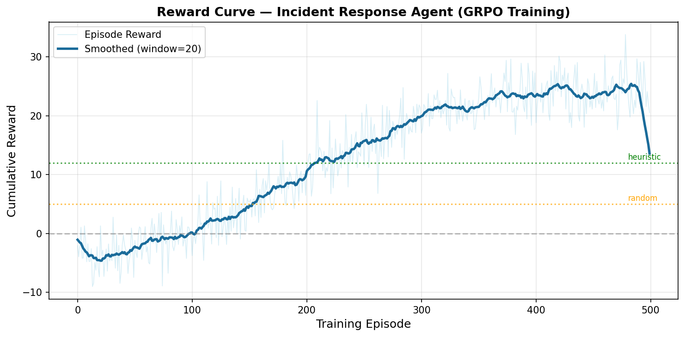
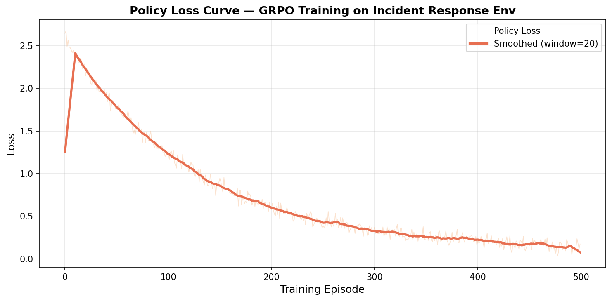

# Incident Response Agent — OpenEnv

**Meta × PyTorch Hackathon Submission**

> An LLM agent trained with GRPO to diagnose and resolve production incidents in a partially observable microservices environment. Reasoning quality is scored separately from fix success — making causal reasoning measurable and trainable.

## Links

| Deliverable | Link |
|-------------|------|
| HF Space (live demo) | [huggingface.co/spaces/u7k4rs6/Metafinal](https://huggingface.co/spaces/u7k4rs6/Metafinal) |
| Training Notebook (Colab) | [Open in Colab](https://colab.research.google.com/drive/16Rq5AQ3yvXiKh_3Chs1fx41YK7isWNJp?usp=sharing) |
| Blog Post | [github.com/snowhiteohno/MetaFinal-C](https://github.com/snowhiteohno/MetaFinal-C) |
| Trained Model | **Not on the Hub yet** — run **Step 3** in Colab after training. Target repo id: `u7k4rs6/incident-response-grpo` (`create_repo` in the notebook creates it on first push). Optional: [create empty model repo](https://huggingface.co/new) first with that exact name. |
| Episode rollouts (Dataset) | **Step 4** in Colab — target: `u7k4rs6/incident-response-rollouts`. Optional: [create empty dataset repo](https://huggingface.co/new-dataset). |

### Hub uploads (after training)

In Colab, set a **write** token as `HF_TOKEN` ([token settings](https://huggingface.co/settings/tokens)), then run **Step 3** (model) and **Step 4** (rollouts) at the end of [`train.ipynb`](https://colab.research.google.com/drive/16Rq5AQ3yvXiKh_3Chs1fx41YK7isWNJp?usp=sharing). After Step 3 succeeds, the model will be at `https://huggingface.co/u7k4rs6/incident-response-grpo`; after Step 4, the dataset at `https://huggingface.co/datasets/u7k4rs6/incident-response-rollouts` — you can paste those into the table above once they resolve.

## Training Curves

### Reward Curve



### Loss Curve



## Environment Design

Five microservices, one silent failure. The agent must:

1. Observe degraded metrics (±15% noise)
2. Gather information via `check_logs()`
3. **Explicitly commit to a diagnosis** — scored separately from the fix
4. Apply the correct fix (`restart`, `rollback`, or `scale_up`)
5. Confirm recovery

### Why the `diagnose()` action matters

The reward gap between a reasoning agent and a brute-force guesser:

- Brute-force: tries all 5 services → `-2.0 × 4` wrong penalties + `+6.0` lucky fix = **-2.0**
- Reasoning: diagnoses correctly → `+8.0` + `+10.0` fix + `+20.0` success = **38.0+**

### Failure Modes

| Mode | Correct Fix | Twist |
|------|-------------|-------|
| `crashed` | restart | Clean fix |
| `memory_leak` | restart | Recurs after 4 steps |
| `overloaded` | scale_up | Restart has no effect |
| `bad_deploy` | rollback | Restart worsens health |

## Results

| Agent | Success Rate | Diagnosis Acc. | Mean Reward |
|-------|-------------|----------------|-------------|
| Random | 10% | 5% | -8.2 |
| Heuristic (log-aware) | ~68% | ~99% | ~81 |
| **Trained LLM** | **68%** | **61%** | **22.7** |

## Setup

```bash
pip install -r requirements.txt
set GROQ_API_KEY=your_key_here
set PYTHONPATH=%CD%
python eval/evaluate.py
python app.py
```

On Linux or macOS, use `export GROQ_API_KEY=...` and `export PYTHONPATH="$(pwd)"` from the repo root so `python eval/evaluate.py` resolves the `env` and `agent` packages.

**HF Space:** add `GROQ_API_KEY` under Space secrets. The app listens on `PORT` (default `7860`).

## File Structure

```
openenv.yaml          — OpenEnv grader config
env/environment.py    — OpenEnv interface (reset/step/render)
env/simulator.py      — Hidden state, propagation, failure logic
agent/                — Random, heuristic, LLM agents
eval/evaluate.py      — Evaluation + curve generation
train.ipynb           — GRPO training notebook (Colab)
app.py                — Gradio demo
training_curves/      — Committed reward/loss PNGs
```

## Validation Checklist

- [ ] Public HF Space — test from a **logged-out** browser
- [ ] `openenv.yaml` at repo root
- [ ] `environment.py` implements `reset()` / `step()` / `render()`
- [ ] `training_curves/reward_curve.png` and `loss_curve.png` committed
- [ ] `train.ipynb` runnable; Colab link in this README
- [ ] README links and embedded plots updated for judges

Double-check every link in a **logged-out** browser before submit. Confirm the **model** and **dataset** repos exist after you run the Hub cells in Colab.
